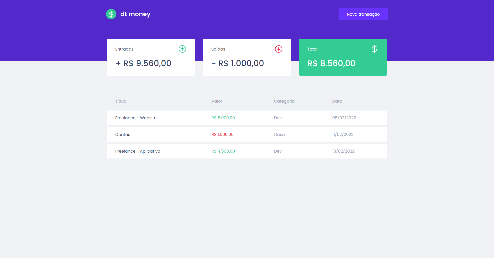
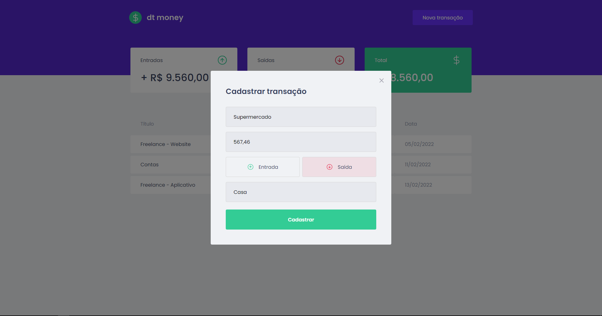

<br />

<div align="center">
  
</div>

## Sobre

dt.money é um website para gerenciamento de gastos desenvolvido durante as aulas do curso Ignite da Trilha ReactJS da [Rocketseat](https://rocketseat.com.br).

<br />



<br />



<br />

## Tecnologias

- [ReactJS](https://reactjs.org/)
- [TypeScript](https://www.typescriptlang.org/)
- [Axios](https://axios-http.com/)
- [MirageJS](https://miragejs.com/)
- [Styled Components](https://www.styled-components.com/)
- [Polished](https://github.com/styled-components/polished)
- [React Modal](https://github.com/reactjs/react-modal)

<br />

## Como executar

```sh
# Clone o repositório do projeto

$ git clone https://github.com/heyloh/dt.money


# Vá até a pasta

$ cd dt.money


# Instale as dependências

$ yarn


# Inicie a aplicação

$ yarn start
```

<br />

<div align="center">
  <p>Desenvolvido com 💜 por Lohana Torres.</p>
</div>
